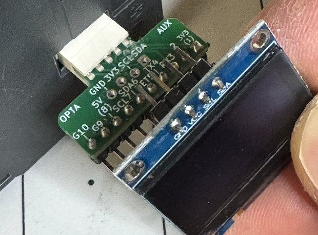
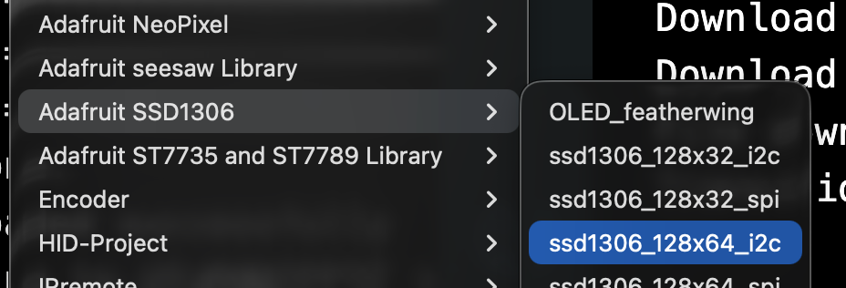
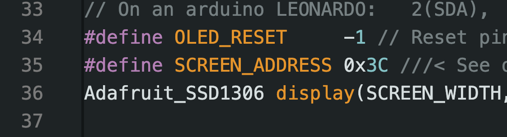
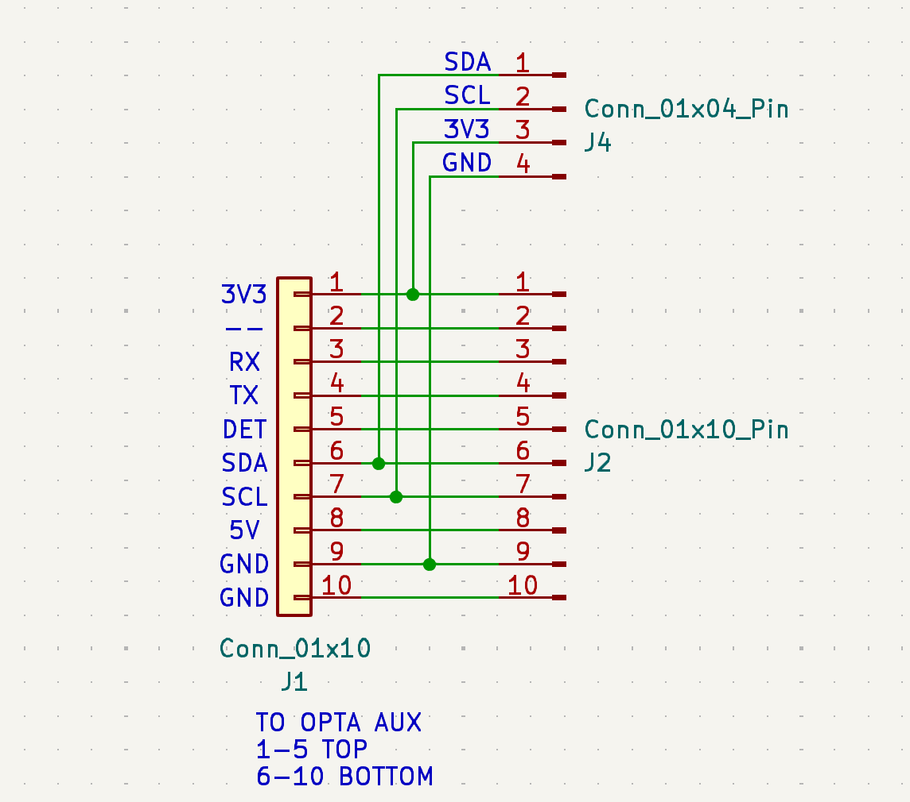

Example code for serial/I2C breakout, using SSD1306 OLED display
available here: https://www.tindie.com/products/35482

## CODE SNIPPETS IN REPOSITORY

* **simple_i2c_textscroll.ino** - scrolls different characters across the screen
* **button_response** - responds with YES or NO depending on if button is depressed
* **button_presses.ino** - counts the total number of button presses
* **pcf8574_3xblink.ino** - blinks 3 leds with pcf8574 IO expander

## ADAFRUIT DISPLAY EXAMPLE:

To run SSD1306 I2C test, insert pins into stagered holes as shown, then load SSD1306_128x64_i2c example  
from Adafruit SSD1306 library. likely need to Change SCREEN_ADDRESS to 0x3C as shown before compiling/sending  
to Opta.

Step 1: Load example

Step 2: change address (likely needed, depends on model)

Send to Opta! 

VIDEO: https://x.com/JeremySCook/status/2028594824698360212

## ADAFRUIT I2C SERVO EXAMPLE (PCA9685)

Step 1: Purchase
* Adafruit: https://www.adafruit.com/product/815 (untested)
* Amazon: https://amzn.to/4t4oKs0 (affiliate)

Step 2:

Load Adafruit PWM Servo Library

Step 3:

Load servo example code from library

Step 4:

Attach servo/board/power as shown in video: https://x.com/JeremySCook/status/2035444297412088181

## SCHEMATIC:

