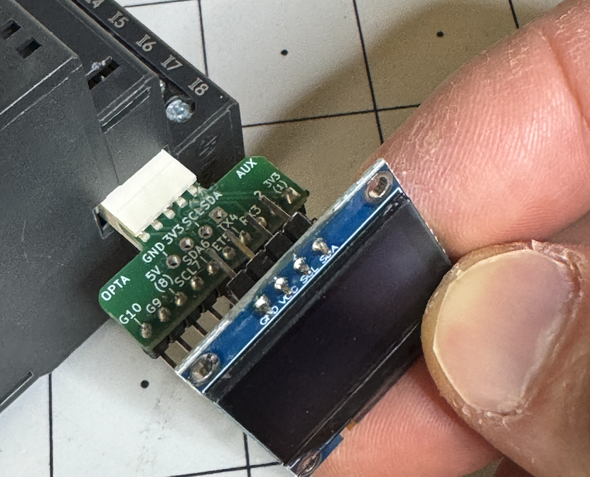

Example code for serial/I2C breakout, using SSD1306 OLED display
available here: https://www.tindie.com/products/35482

## CODE SNIPPETS IN REPOSITORY

* simple_i2c_textscroll.ino - scrolls different characters across the screen
* Button response - WIP

## ADAFRUIT EXAMPLE:

To run SSD1306 I2C test, insert pins into stagered holes as shown, then load SSD1306_128x64_i2c example  
from Adafruit SSD1306 library. likely need to Change SCREEN_ADDRESS to 0x3C as shown before compiling/sending  
to Opta.

Step 1: Load example

Step 2: change address (likely needed, depends on model)

Send to Opta!

